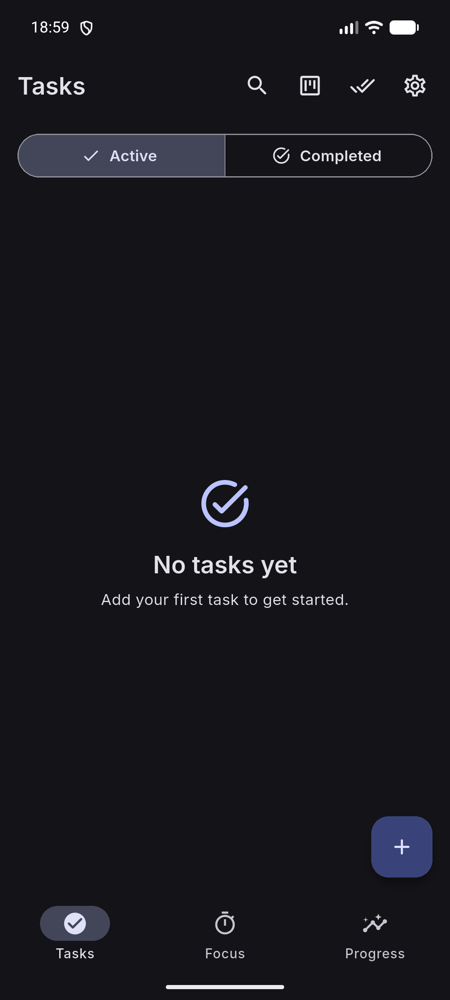
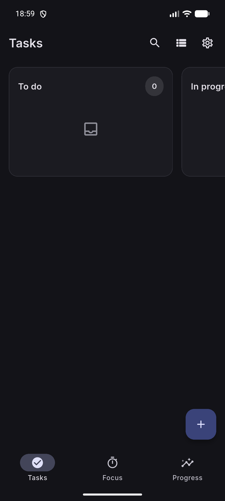
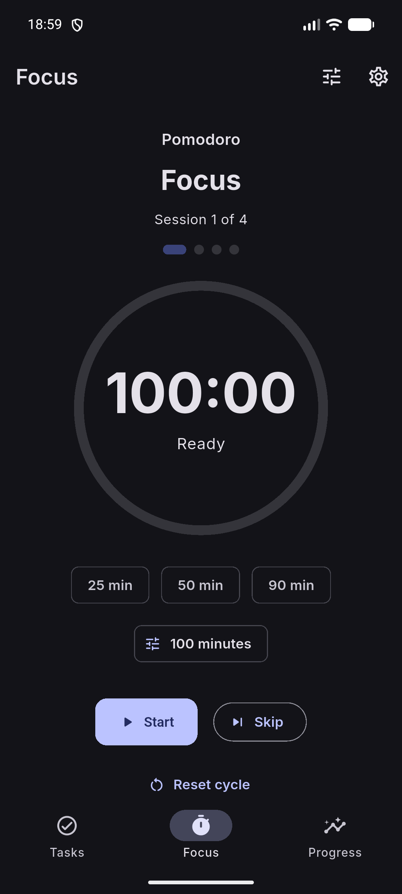
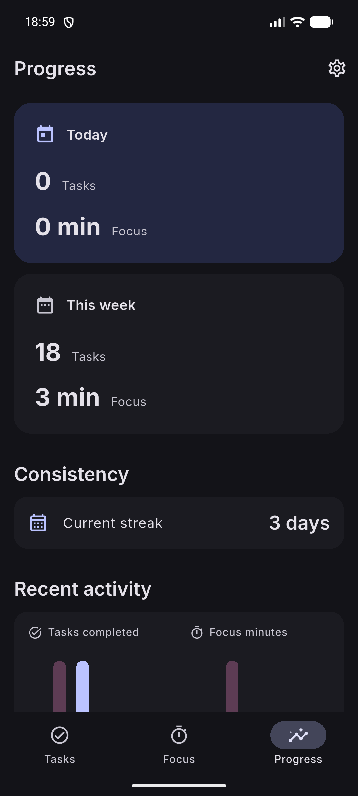
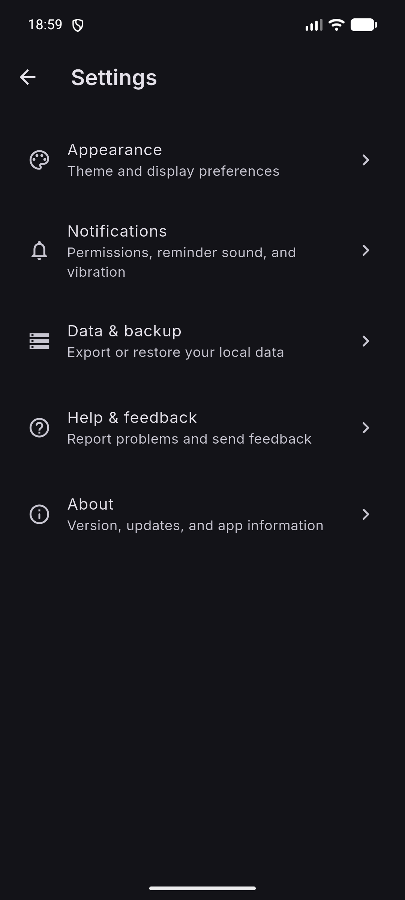

<p align="center">
  <picture>
    <source media="(prefers-color-scheme: dark)" srcset="branding/perfica_logo_dark.png">
    <source media="(prefers-color-scheme: light)" srcset="branding/perfica_logo_light.png">
    
  </picture>
</p>

<p align="center">
  A modern, offline-first productivity application for tasks, focus, reminders,
  progress tracking, and portable local backups.
</p>

<p align="center">
  <strong>Flutter · Dart · Drift · BLoC/Cubit · GPL-3.0-or-later</strong>
</p>

---

# Perfica

Perfica is a free and open-source productivity application maintained by
**Veltaluma** as the canonical upstream project.

Its core workflow is local-first: tasks, focus history, settings, progress data,
and backups are stored locally on the user's device and do not require a Perfica
cloud account.

Network access is used only by features that inherently require it, such as
checking official releases and submitting a bug report when the user explicitly
chooses to send one.

## Screenshots

<p align="center">
  
  
  
  
  
</p>

## Core areas

Perfica currently revolves around three primary destinations:

- **Tasks** — create, organize, search, schedule, and complete work.
- **Focus** — run configurable focus and Pomodoro sessions.
- **Progress** — review productivity history derived from local task and focus data.

Settings, task editing, focus configuration, backup/restore, update checking, and
bug reporting are available as additional screens.

## Features

### Task management

Tasks can include:

- title and description;
- priority;
- due date and time;
- workflow status;
- tags;
- attachments;
- subtasks;
- recurrence;
- reminders;
- repeated reminder alerts.

Workflow states include:

- **To do**
- **In progress**
- **Done**

The Tasks feature also supports active/completed filtering, search, bulk
completion, clearing completed tasks while preserving productivity history, and
both list and board presentations.

### Task board

The board is a presentation mode inside the Tasks feature rather than a separate
domain module. This keeps board state aligned with the task domain and task
repository.

### Recurring tasks

Recurring-task handling is separated from normal one-time completion so future
occurrences are not accidentally lost. Users can also stop recurrence or
permanently complete a repeating task.

### Reminders and notifications

Perfica supports scheduled task reminders and notification actions, including:

- one-time alerts;
- configurable repeated alerts;
- sound preference;
- vibration preference;
- completion actions;
- snooze actions;
- scheduling restoration where supported;
- Android boot-time restoration behavior.

Notification permission remains under user control.

### Subtasks, tags, and attachments

Tasks can contain structured supporting information:

- ordered subtasks;
- subtask completion progress;
- tags;
- locally managed attachments.

Attachment storage and backup handling are separated from ordinary task text.

### Android home-screen task widget

The Android build contains a native home-screen task widget with dedicated
Kotlin components and Flutter-side snapshot/background coordination.

Changes to task persistence or task actions must therefore consider both the main
Flutter UI and the Android widget.

### Focus timer

The Focus feature provides:

- configurable focus duration;
- start;
- pause;
- resume;
- reset;
- completed focus-session history.

### Pomodoro workflow

Pomodoro functionality includes:

- focus duration;
- short-break duration;
- long-break duration;
- sessions per cycle;
- automatic break start;
- automatic focus start;
- completion sound;
- vibration;
- phase skipping;
- cycle reset;
- runtime restoration.

Completed focus sessions contribute to Progress statistics.

### Progress and productivity history

The Progress screen derives summaries from local task-completion and focus data.

Current metrics include:

- tasks completed;
- focus minutes;
- current streak;
- recent activity;
- consistency information;
- best day;
- daily averages;
- week-over-week comparisons;
- weekly totals;
- monthly totals;
- lifetime information.

### Appearance

Perfica supports:

- system theme;
- light theme;
- dark theme.

Theme state is persisted locally.

### Backup and restore

Perfica stores application data in a local Drift/SQLite database.

The backup subsystem supports current portable backups and supported historical
formats. Portable backups can include:

- normalized database data;
- task metadata;
- focus history;
- attachments;
- manifest information.

See [Backup Format](docs/BACKUP_FORMAT.md).

### Diagnostics and bug reporting

Perfica keeps a limited local diagnostic history for troubleshooting.

A bug report may include:

- app version;
- OS information;
- device information;
- locale;
- optional recent diagnostics.

Diagnostics remain local until the user explicitly chooses to submit a report,
and the report can be reviewed before submission.

### Update checking

Perfica can query the official GitHub repository for a newer release and open the
official release page.

It does not silently replace the installed application.

## Offline-first and privacy model

Perfica's normal task, focus, progress, appearance, and backup workflows operate
from local data.

Features that may use networking are explicit:

- official release checking;
- user-initiated bug-report submission.

Offline-first does not mean the Android package contains no networking
permission. It means the core productivity workflow is not dependent on a
Perfica cloud account.

## Platforms

### Android

Android is the currently validated primary platform and the target of F-Droid
distribution work.

Application ID:

```text
com.veltaluma.perfica
```

### iOS

The repository contains an iOS Flutter project. iOS is outside F-Droid and is
not represented here as having the same release-validation status as Android.

## Installation

### F-Droid

F-Droid build metadata is included in the repository.

Perfica should not be described as available in the official F-Droid repository
until the upstream submission has actually been accepted and published.

### GitHub releases

Canonical repository:

```text
https://github.com/Veltaluma/Perfica
```

### Build from source

See [Development Guide](docs/DEVELOPMENT.md).

Quick start:

```bash
flutter pub get --enforce-lockfile
flutter run
```

## Development baseline

The currently validated baseline is:

- Flutter 3.47.5 stable
- Dart 3.13.4
- Flutter revision `6a19cca564`
- Android Gradle Plugin 9.4.0
- Kotlin Gradle Plugin 2.4.20
- Gradle 9.8.0
- Java source/target level 17
- Android NDK 30.0.16248370

Android compile SDK, target SDK, and minimum SDK follow the Flutter/Android
project configuration.

Do not mix toolchain upgrades into unrelated feature or bug-fix work.

## Architecture

Perfica follows a feature-first architecture:

```text
lib/
├── app/
│   ├── router/
│   ├── shell/
│   ├── widgets/
│   ├── bootstrap.dart
│   ├── dependencies.dart
│   └── perfica_app.dart
├── core/
│   ├── constants/
│   ├── database/
│   ├── design_system/
│   └── services/
├── features/
│   ├── bug_report/
│   ├── focus/
│   ├── insights/
│   ├── settings/
│   └── tasks/
├── l10n/
└── main.dart
```

Dependency ownership follows an intentional split:

- **Provider / MultiProvider** supplies services and repositories.
- **BlocProvider / Cubit** owns application state.

See [Architecture](docs/ARCHITECTURE.md).

## Generated files

Do not manually edit generated source files.

Important examples:

```text
lib/core/database/app_database.g.dart
lib/l10n/app_localizations.dart
lib/l10n/app_localizations_en.dart
```

Regenerate them from their source definitions when required.

## Testing

Before submitting a contribution:

```bash
flutter pub get --enforce-lockfile
flutter test --no-pub
flutter analyze --no-pub
dart format --output=none --set-exit-if-changed lib test
```

The documentation baseline was validated with **205 passing tests**.

## Contributing

Contributions are welcome.

Read [CONTRIBUTING.md](CONTRIBUTING.md) before opening a pull request.

The contributor guide covers repository setup, project architecture, generated
files, task/focus behavior, database migrations, backup compatibility,
localization, tests, UI changes, pull-request preparation, review, and
contribution licensing.

## Reporting bugs

For ordinary bugs, use Perfica's built-in reporting flow or the GitHub bug-report
form.

For security-sensitive issues, follow [SECURITY.md](SECURITY.md) instead of
posting exploit details publicly.

## Support

See [SUPPORT.md](SUPPORT.md).

## Support development

Perfica is free and open-source software.

A donation path is reserved, but no donation provider or payment URL is
published yet.

When an official donation destination is selected, README, SUPPORT, GitHub
funding configuration, and F-Droid donation metadata can be updated without
changing the software license.

## License

Perfica is licensed under the **GNU General Public License version 3 or, at your
option, any later version (`GPL-3.0-or-later`)**.

See:

- [LICENSE](LICENSE) — complete, unmodified GNU GPL version 3 text;
- [COPYRIGHT](COPYRIGHT) — Perfica-specific copyright information.

The `2007` copyright notice inside `LICENSE` belongs to the Free Software
Foundation's GPLv3 license text. It is not Perfica's copyright year.

Perfica project copyright information uses **2026**.

## Third-party software and assets

Third-party components remain subject to their own licenses.

Perfica bundles the Inter typeface under the SIL Open Font License 1.1.

See:

- [THIRD_PARTY_NOTICES.md](THIRD_PARTY_NOTICES.md)
- [assets/fonts/OFL.txt](assets/fonts/OFL.txt)

## Project stewardship

**Project:** Perfica

**Canonical upstream organization:** Veltaluma

**Canonical repository:** `Veltaluma/Perfica`

Copyright in individual contributions remains with the respective copyright
holders unless explicitly assigned otherwise in writing.

---

Perfica is built in the open under `GPL-3.0-or-later`.
